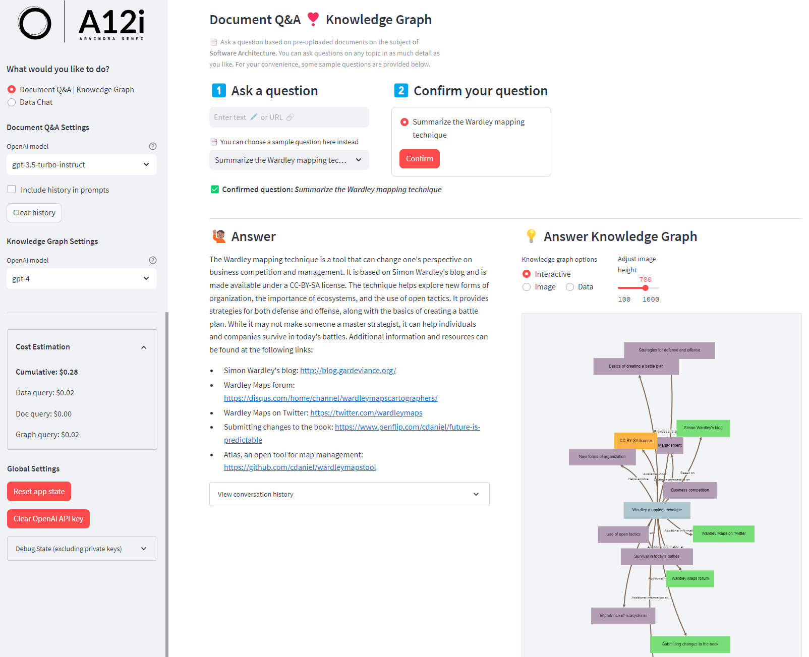

# LLM | DOC Q&A | KNOWLEDGE GRAPH | EXCEL DATA CHAT
> _Integrated LLM-based document and data Q&A with knowledge graph visualization_

> Arvindra Sehmi, A12i (CloudOpti Ltd.) | [LinkedIn](https://www.linkedin.com/in/asehmi/)

> Updated: 9 December, 2023

---

### Introduction

I built this app because I'm writing some chapters for an upcoming book on Streamlit. This app helps me digest a large quantity of information from articles and documents I have on the subject of Software Architecture. I wanted to be able to ask questions about the documents and get answers, and also to visualize the answers in a knowledge graph. I also wanted to upload Excel files and ask questions about the data in the files.

The application is a typical LLM application, with the addition of a knowledge graph visualization. The app is built in Python using Streamlit. I was inspired by [instagraph](https://github.com/yoheinakajima/instagraph) and re-implemented its graph plot as a Streamlit custom component. I use the Weaviate Cloud (vector) Store (WCS) for document and data indexing. OpenAI, LangChain, and LlamaIndex LLM programming frameworks play an important role too. The application supports local filestore indexing in addition to WCS. OpenAI embeddings are used and the OpenAI API is called, directly or via the other LLM frameworks, for question answering. Hence, you will need an OpenAI API key to use the application. Various LLM models are used for question answering, including the GPT-4-Turbo Turbo and GPT-4 models. They are used for bot chat and completions. Token usage is tracked and costs are estimated.

The application is deployed on Streamlit Cloud. When deployed in the cloud, the application uses WCS. When deployed locally, the application can be configured to use LlamaIndex to store its index in the local file system.



### Streamlit App Demo

In this demo:

1. The user selects or enters a question to query over documents or data which have been indexed into Weaviate (a cloud-based vector store) 
2. The app displays the question answer and generates a knowledge graph to complement the answer
3. The user can upload an Excel file which can be displayed and queried using natural language
4. The app allows the user to enter their OpenAI API key and select the model(s) to use for question answering
5. The app displays a per-query cost estimate and a running total of the cost of the queries


### Try the demo app yourself

The application can be seen running in the Streamlit Cloud at the link below:

[](https://docs-n-data-knowledge-app.streamlit.app/)

**NOTE:** You will need to enter your own OpenAI API. The key is ephemeral and not stored permanently in the application. Once entered, the API Key input box will be hidden and you can start using the app. To re-enter the API Key, a button is provided to clear the current key from memory, after which you can re-enter another key. 

### Installation

Ensure you have installed package requirements with the commands:

```bash
# change to the Streamlit <app root folder>, e.g.
cd ./docs-n-data-knowledge-app
pip install -r requirements.txt
```

**Important:** Modify the `secrets.toml` file in the application `.streamlit` root based on the example available in `secrets.toml.sample`.

```bash
OPENAI_API_KEY='<Your OpenAI API Key>'
WEAVIATE_API_KEY='<Your Weaviate API Key>'
WEAVIATE_URL='https://<Your Weaviate Cluster ID>.weaviate.network'
IS_CLOUD_DEPLOYMENT='true' # 'true' = deployed on st cloud | 'false' = deployed locally
```

In `globals.py` you can change the following variables to affect application behaviour:

```python
# See: https://openai.com/pricing
LANG_MODEL_PRICING = {
    # Friendly aliases used in app
    'gpt-4': {'input': 0.03, 'output': 0.06},                       # per 1000 tokens
    'gpt-4-turbo': {'input': 0.01, 'output': 0.03},                 # per 1000 tokens
    # Actual model names used in app
    'gpt-4-1106-preview': {'input': 0.01, 'output': 0.03},          # per 1000 tokens
    'gpt-3.5-turbo-instruct': {'input': 0.0015, 'output': 0.002},   # per 1000 tokens
}

VECTOR_STORE = 'Weaviate' # 'Weaviate' | 'Local'

# Sample questions for the Document Q&A functionality, based on the topic of _my_ indexed documents
SAMPLE_QUESTIONS = [
    "None",     # required
    "Summarize the most important concepts in a high performance software application",
    "Summarize the Wardley mapping technique",
    #  :
    # ETC.
    #  :
    "Most important factors of high performing teams",
]
```

Now run Streamlit with `app.py`:

```bash
# I prefer to set the port number too
streamlit run --server.port 4010 app.py
```

**NOTE:** Whilst there is some clean-up of the structured data expected in the LLM responses, LLMs don't always return data you expect. You might therefore encounter errors. If you do, try changing the LLM model selected and re-run your queries.

### TODO

- Possibly, remove the data page functionality from app and create a separate project for it
- Implement file upload document Q&A

---

If you enjoyed this app, please consider starring this repository.

Thanks!

Arvindra